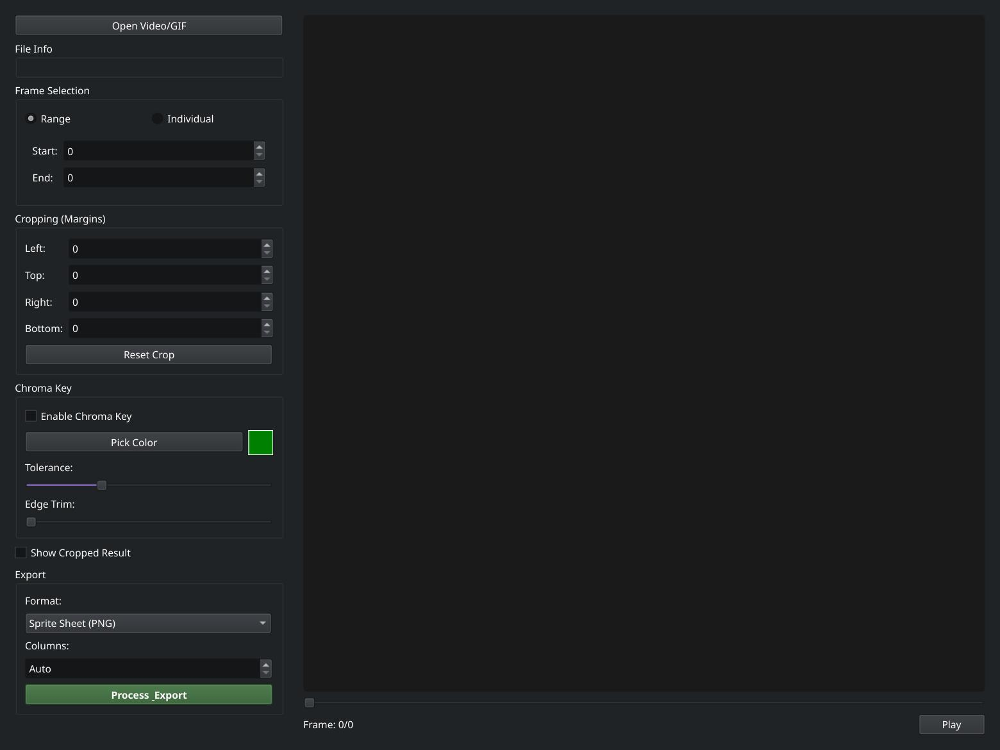
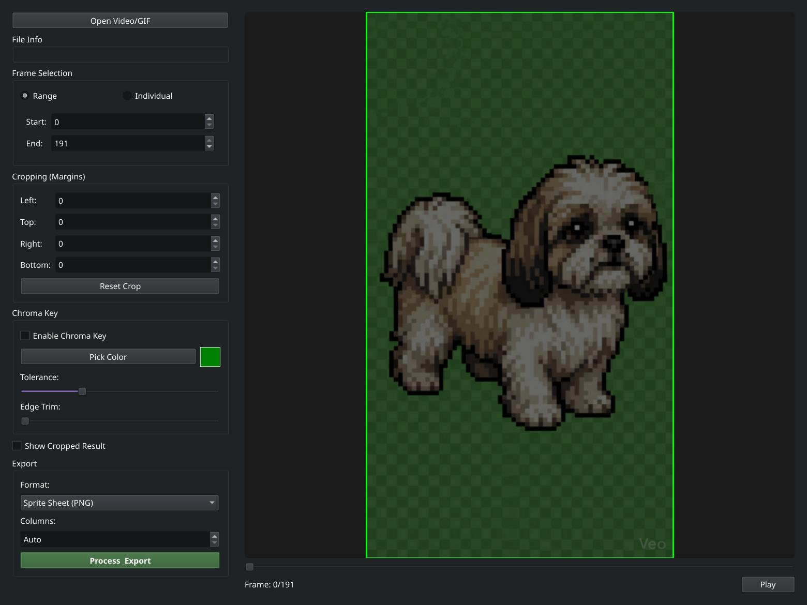
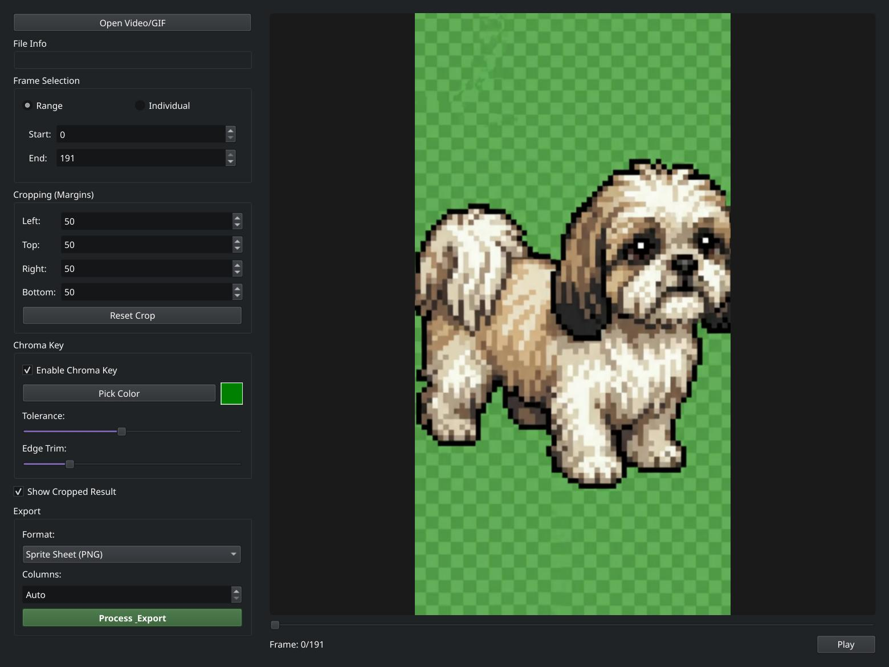
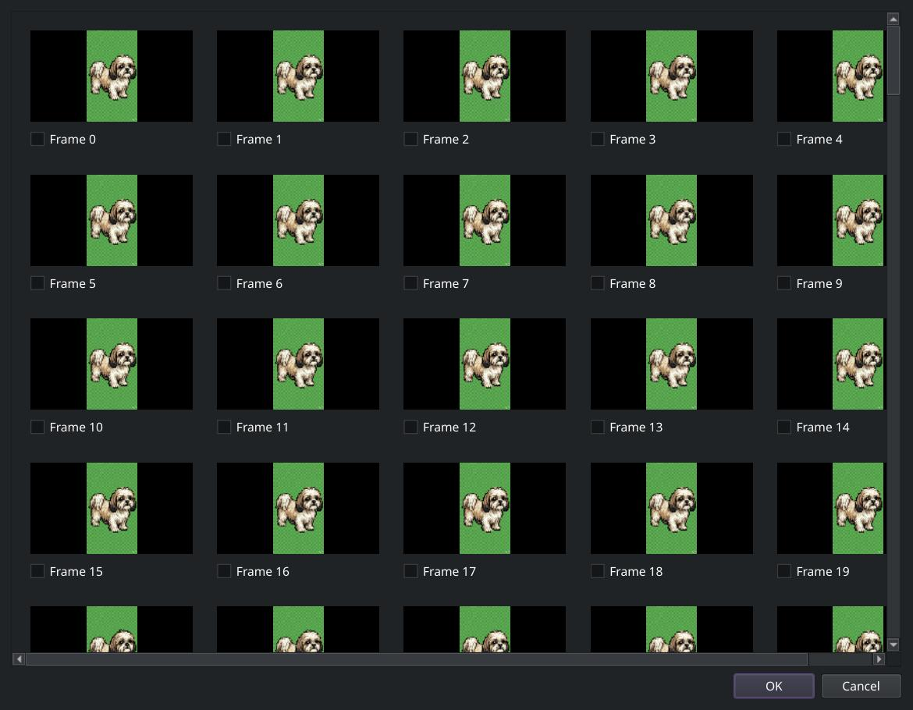

# SpriteSpite

SpriteSpite is a specialized Linux desktop application designed for game developers to convert videos and GIFs into optimized game assets, including Animated GIFs, MP4s, and Godot-ready Sprite Sheets.

## Features
- **Media Support**: Load MP4, MKV, WebM, and GIF files.
- **Smart Frame Selection**: 
  - **Range Mode**: Select a continuous start and end point.
  - **Individual Mode**: Select specific frames in any order (e.g., `10, 2, 5-8`).
  - **Visual Picker**: Select frames from a grid of thumbnails.
- **Advanced Processing**:
  - **Margin-based Cropping**: Numeric control or manual click-and-drag selection with a real-time mask overlay.
  - **Subject-Centric Chroma Key**: High-quality background removal that preserves internal colors and allows for "Edge Trimming" (choke) on the silhouette.
  - **Transparency Visualization**: Checkerboard background for accurate previewing.
- **Optimized Export**:
  - **Sprite Sheets**: Packages frames into a PNG grid with customizable columns.
  - **Godot 4 Integration**: Automatically generates a `.txt` file with grid metadata and import instructions.
  - **MP4 & GIF**: High-quality sequence export (MP4s use a white background for transparency).

## Visual Gallery

### Application Interface
| Main Interface | Video Loaded |
| :---: | :---: |
|  |  |

| Processing (Crop & Chroma) | Multi-Frame Selector |
| :---: | :---: |
|  |  |

### Sample Output
**Processed Sprite Sheet (PNG with Transparency):**


## Prerequisites
- **Python**: 3.10+
- **System**: `ffmpeg` (for video decoding support).
- **Manager**: `uv` for dependency management.

### Installing `uv`
```bash
curl -LsSf https://astral.sh/uv/install.sh | sh
```

## Installation & Running
1. Clone this repository.
2. Install dependencies:
   ```bash
   uv sync
   ```
3. Run the application:
   ```bash
   uv run app/main.py
   ```

## User Guide

### 1. Loading Media
Click **"Open Video/GIF"** at the top of the left panel. Once loaded, file metadata (resolution, FPS, total frames) will appear in the "File Info" box.

### 2. Selecting Frames
- **Range Mode**: Set a start and end frame. Use the "Play" button to preview the animation loop.
- **Individual Mode**: 
  - Type frame numbers manually (e.g., `0, 5, 12`).
  - Use **"Add Current Frame"** while scrubbing the slider to build a list pose-by-pose.
  - Use **"Select Multiple Frames..."** to open a visual grid and pick frames by their thumbnails.
  - *Note: Frames are exported in the exact order you list them.*

### 3. Cropping
- **Manual**: Click and drag on the preview image to draw a green crop box. The margins will update automatically.
- **Numeric**: Use the Left, Top, Right, and Bottom spinboxes to fine-tune the crop.
- **Visualization**: Areas to be removed are darkened. Toggle **"Show Cropped Result"** to zoom in on the final output.

### 4. Chroma Key (Transparency)
- **Picking**: Enable Chroma Key, click **"Pick Color"**, and then click on the background color in the video preview.
- **Tolerance**: Adjust the slider until the background disappears (the checkerboard will show through).
- **Edge Trim**: Use this to "choke" the mask, removing thin color outlines around your character.

### 5. Exporting
1. Select your format (**Sprite Sheet**, **GIF**, or **MP4**).
2. For Sprite Sheets, set columns to **"Auto"** for a square layout or choose a specific count.
3. Click **"Process & Export"**.
4. If exporting a Sprite Sheet, a `.txt` file will be created next to your `.png` with Godot 4 import steps.

## Godot 4 Workflow
SpriteSpite makes importing into Godot 4 seamless:
1. Drag the exported `.png` into your Godot project.
2. Open the accompanying `.txt` file.
3. Create an `AnimatedSprite2D` or `Sprite2D` node.
4. Use the "Add Frames from Sprite Sheet" option in the SpriteFrames editor.
5. Enter the **Horizontal** and **Vertical** grid counts provided in the SpriteSpite `.txt` file.

## How to Test
To verify the application is working correctly:
1. Launch the app and load a sample video (e.g., `test.mp4`).
2. Scrub to frame 10 and click **"Add Current Frame"**.
3. Scrub to frame 20 and click **"Add Current Frame"**.
4. Draw a small crop box around a detail.
5. Enable Chroma Key and pick the background.
6. Export as **Sprite Sheet (PNG)**.
7. Open the PNG and verify it contains exactly 2 frames, cropped and transparent.
8. Verify the `.txt` file lists `Total Frames: 2`.

## Performance
SpriteSpite uses an **LRU Cache** for video frames. If scrubbing feels slow on very long/high-res videos, the app will automatically prioritize the most recently viewed frames to keep the interface snappy.
